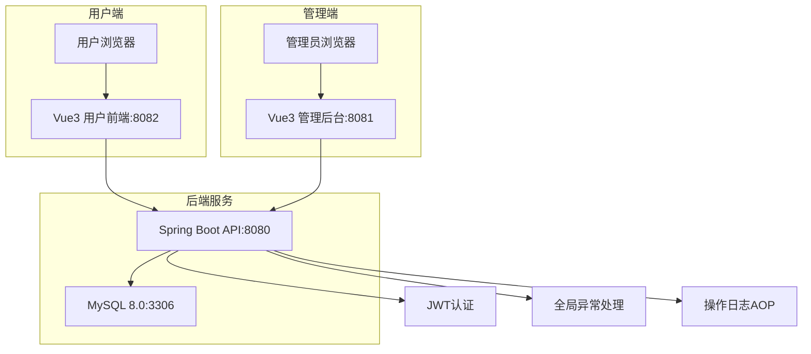
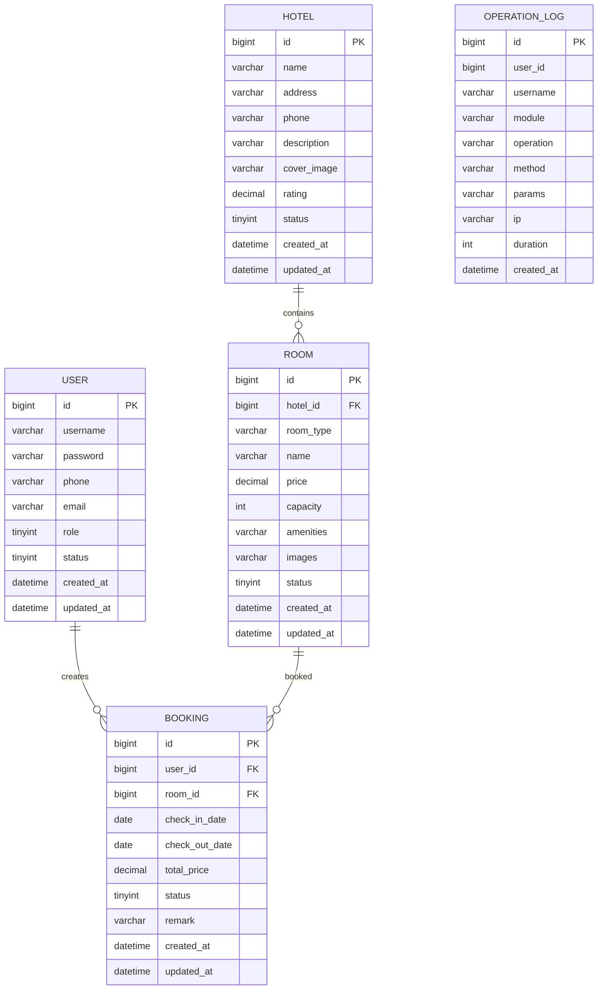

# 酒店预订系统 - 项目设计文档

## 1. 系统架构

## 2. ER 图

## 3. 接口清单

### 3.1 认证模块 (AuthController)
| 方法 | 路径 | 描述 |
|------|------|------|
| POST | /api/auth/login | 用户登录 |
| POST | /api/auth/register | 用户注册 |
| POST | /api/auth/logout | 退出登录 |
| GET | /api/auth/info | 获取当前用户信息 |

### 3.2 用户管理 (UserController) - 管理端
| 方法 | 路径 | 描述 |
|------|------|------|
| GET | /api/admin/users | 分页查询用户 |
| GET | /api/admin/users/{id} | 获取用户详情 |
| PUT | /api/admin/users/{id}/status | 更新用户状态 |
| DELETE | /api/admin/users/{id} | 删除用户 |

### 3.3 酒店管理 (HotelController)
| 方法 | 路径 | 描述 |
|------|------|------|
| GET | /api/hotels | 分页查询酒店 |
| GET | /api/hotels/{id} | 获取酒店详情 |
| POST | /api/admin/hotels | 新增酒店 |
| PUT | /api/admin/hotels/{id} | 更新酒店 |
| DELETE | /api/admin/hotels/{id} | 删除酒店 |

### 3.4 房间管理 (RoomController)
| 方法 | 路径 | 描述 |
|------|------|------|
| GET | /api/rooms | 分页查询房间 |
| GET | /api/rooms/{id} | 获取房间详情 |
| GET | /api/hotels/{hotelId}/rooms | 获取酒店房间列表 |
| POST | /api/admin/rooms | 新增房间 |
| PUT | /api/admin/rooms/{id} | 更新房间 |
| DELETE | /api/admin/rooms/{id} | 删除房间 |

### 3.5 预订管理 (BookingController)
| 方法 | 路径 | 描述 |
|------|------|------|
| GET | /api/bookings | 查询预订列表 |
| GET | /api/bookings/{id} | 获取预订详情 |
| POST | /api/bookings | 创建预订 |
| PUT | /api/bookings/{id}/cancel | 取消预订 |
| PUT | /api/admin/bookings/{id}/status | 更新预订状态 |

### 3.6 操作日志 (LogController) - 管理端
| 方法 | 路径 | 描述 |
|------|------|------|
| GET | /api/admin/logs | 分页查询操作日志 |

## 4. UI/UX 规范

### 4.1 色彩系统
- 主色调: `#1890ff` (科技蓝)
- 成功色: `#52c41a`
- 警告色: `#faad14`
- 错误色: `#f5222d`
- 背景色: `#f0f2f5`
- 卡片背景: `#ffffff`
- 文字主色: `#333333`
- 文字次色: `#666666`
- 边框色: `#e8e8e8`

### 4.2 字体规范
- 主字体: `-apple-system, BlinkMacSystemFont, 'Segoe UI', Roboto, 'Helvetica Neue', Arial, sans-serif`
- 标题字号: 20px / 18px / 16px
- 正文字号: 14px
- 辅助字号: 12px

### 4.3 间距规范
- 基础单位: 8px
- 常用间距: 8px / 16px / 24px / 32px
- 卡片内边距: 24px
- 页面边距: 24px

### 4.4 圆角规范
- 按钮圆角: 4px
- 卡片圆角: 8px
- 输入框圆角: 4px

### 4.5 阴影规范
- 卡片阴影: `0 2px 8px rgba(0, 0, 0, 0.08)`
- 悬浮阴影: `0 4px 16px rgba(0, 0, 0, 0.12)`
